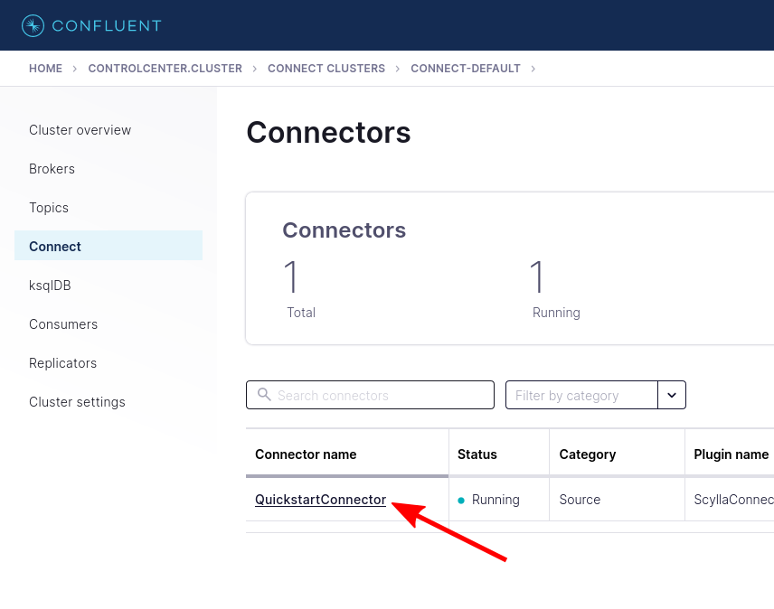
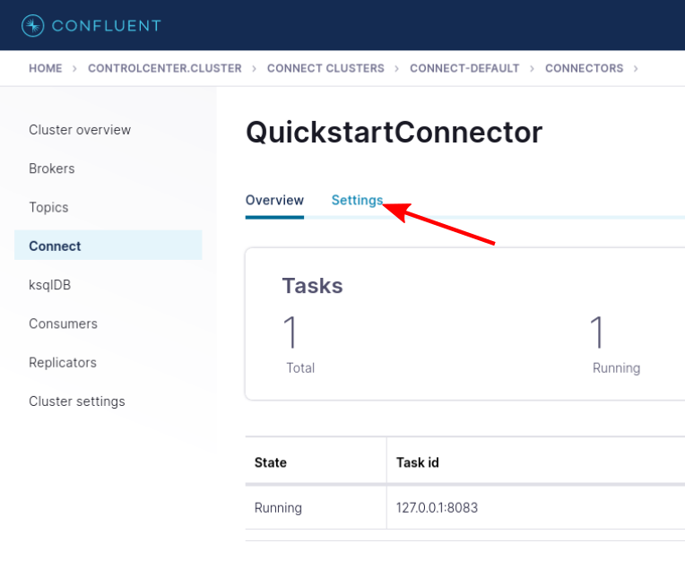
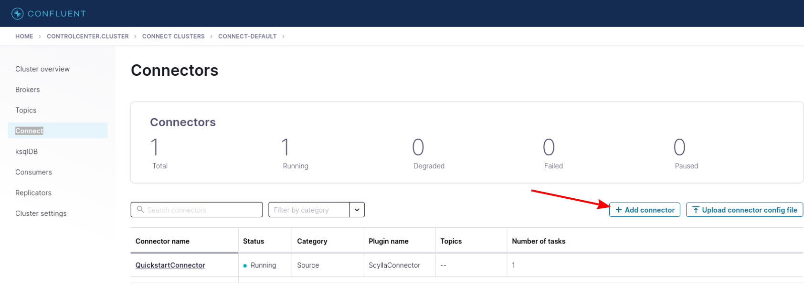

# Connecting Scylla to Elasticsearch

Scylla CDC Source Connector can be paired with Elasticsearch Sink, allowing you to easily search trough your database. This quickstart will show you how to achieve that.

## Prerequisites

This guide assumes that you have already set up Scylla and CDC Source Connector - instructions for that are available in `README-QUICKSTART.md`.

## Source connector configuration

In order for the connector to be compatible with Elasticsearch Sink (and other sinks) you need to use a `ScyllaExtractNewState` transformer. This transformer is described in more detail in [README.md](README.md) file in "`ScyllaExtractNewState` transformer" section. 

1. Open the Confluent Control Center. By default, it is started at port `9021`:
    
    
2. Click on the cluster you want to start the connector in and open the "Connect" tab:
    

3. Click on the Kafka Connect cluster:
    

4. Select CDC source connector that you want to use:
    

5. Go to "Settings" tab:
    

6. Add the transformation. In the "Transforms" field add a transformation, with any name. After doing that, a new section, named `Transforms: YourNameHere` will appear. In that section, from drop-down list, select class name `com.scylladb.cdc.debezium.connector.transforms.ScyllaExtractNewRecordState`.

7. Click "Next" and then "Launch".

## Running Elasticsearch

Now you need to run Elasticsearch instance. The quickest way to do this is to use docker, as described in [this guide](https://www.elastic.co/guide/en/elasticsearch/reference/current/docker.html). There is one small change required: when run with provided command, Elasticsearch runs out of memory after a short while and crashes. You should instead use command below:

```docker run -p 9200:9200 -p 9300:9300 -e "discovery.type=single-node" -e "bootstrap_memory_lock=true" -e "ES_JAVA_OPTS=-Xms512m -Xmx512m" --ulimit memlock=-1:-1 docker.elastic.co/elasticsearch/elasticsearch:7.14.0```

## Configure Elasticsearch Sink connector

Now comes the final part of setup: connecting CDC Source to Elasticsearch.

1. Install sink connector using Confluent hub: `confluent-hub install confluentinc/kafka-connect-elasticsearch:latest`

2. Open the Confluent Control Center. By default, it is started at port `9021`:
    
    
3. Click on the cluster you want to start the connector in and open the "Connect" tab:
    

4. Click on the Kafka Connect cluster:
    

5. Click "Add connector":
    

6. Click "Elasticsearch Sink Connector".

7. Configure the connector:

    1. Input the topic name. In our example it would be `QuickstartConnectorNamespace.ks.t`.
    2. Input any name you want in the "Name" field.
    3. "Key converter class" must be set to `org.apache.kafka.connect.storage.StringConverter`, because Elasticsearch requires document ids to be numbers or strings. This will unfortunately produce pretty ugly looking ids - you can fix that with custom transformer.
    4. "Value converter class" must be set to the same value as in the source connector.
    5. Set "Connection URLs" in "Connector" section to proper Elasticsearch URL - in our example it would be `http://localhost:9200`

8. Test that everything works. Insert some data to the table, you should see it in Elasticsearch. Delete some rows, they should disappear from Elasticsearch.